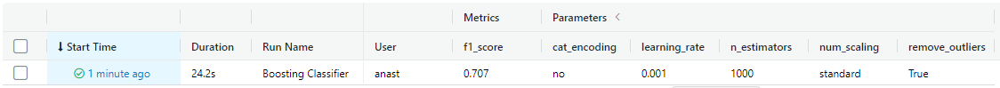

## Description
Forest Cover Type Prediction 
The dataset [Forest Cover Type](https://www.kaggle.com/competitions/forest-cover-type-prediction/data) from Kaggle is used in this project.

### Feature Engineering
For features preprocessing custom class Preprocessing is created, which includes the following options for scaling, encoding and modification of the dataset:
 - Encoding of categorical features: frequency, ordinal or no encoding
 - Scaling of numerical features: standard, min_max or no scaling
 - Outliers removal: true or false
 - Conversiion of negative numerical values into positive: true or false

### Model Training
Logistic Regression, SVM Linear Classifier, Extra Trees Classifier, Random Forest Classifier, Voting Classifier, Gradient Boosting Classifier and Deep Neural Network are used for training. 

 - Logistic Regression, SVM Linear Classifier, Extra Trees Classifier, Random Forest Classifier
Automatic hyperparameters tuning by means of RandomizedSearchCV was implemented to determine best hyperparameters for the four machine learning models. Nested cross validation was employed to select and evaluate the models. F1 score was used as optimization metric for hyperparameters selection. Generalized performance of the classifier was evaluated with three metrics - precision, recall and f1 score.

 - Voting Classifier
Voting classifier is based on previously tuned models - Logistic Regression, SVM Linear Classifier, Extra Trees Classifier, Random Forest Classifier. Hard voting classifier shows better performance than each model individually. 

 - Gradient Boosting Classifier
Gradient boosting classifier is implemented using RandomizedSearchCV for its hyperparameters tuning. F1 score was used as optimization metric for hyperparameters selection.

 - Neural Network
Deep neural networks with different number of layers and inner layers nodes are trained. For inner layers, rulu activation function is used, for outer layer - softmax. For optimization, sparse categorical cross entropy and accuracy metric are chosen.

### Score on Kaggle

