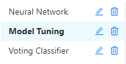
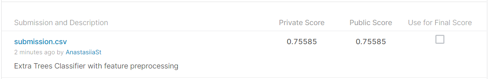

### Description
This is a project for Kaggle competition [Forest Cover Type Prediction](https://www.kaggle.com/competitions/forest-cover-type-prediction/overview). The goal is based on the features such as Elevation, Aspect, Slope, different types of Distances, Hillshade, Wilderness Area and Soil Type to  distinguish seven Forest Cover Types, which include Spruce/Fur, Lodgepole Pine, Ponderosa Pine, Cottonwood/Willow, Aspen, Douglas-fir, Krummholz. Detailed information about training and testing datasets can be found in the [training set report](http://htmlpreview.github.io/?https://github.com/AnastasiiaSt/Capstone-Project/blob/main/profile_report_train.html) and [testing set report](http://htmlpreview.github.io/?https://github.com/AnastasiiaSt/Capstone-Project/blob/main/profile_report_test.html), which were created using pandas profiling module. <br>

### Feature Engineering
For feature preprocessing, custom class Preprocessing is created, which includes the following options for scaling, encoding and modification:
 - Encoding of categorical features: frequency, ordinal or no encoding
 - Scaling of numerical features: standard, min_max or no scaling
 - Outliers removal: true or false
 - Conversion of negative numerical values into positive: true or false

### Model Training
Logistic Regression, Extra Trees Classifier, Random Forest Classifier, Voting Classifier, Deep Neural Network are used for training. The following experiments are created in MLflow: <br>


 - Logistic Regression, Extra Trees Classifier, Random Forest Classifier:<br>
Automatic hyperparameters tuning by means of RandomizedSearchCV is implemented to determine best hyperparameters for the three machine learning models. Nested cross validation is employed to select and evaluate the models. F1 score is used as optimization metric for hyperparameters selection. Generalized performance of the classifier is evaluated with three metrics - precision, recall and f1 score.


 - Voting Classifier:<br>
Voting classifier is based on three previously tuned models - Logistic Regression, Extra Trees Classifier, Random Forest Classifier. 


 - Neural Network:<br>
Deep neural networks with different number of layers and hidden layers nodes are trained. For hidden layers, relu activation function is used, for outer layer - softmax. For optimization, sparse categorical cross entropy and accuracy metric are chosen.


### Score on Kaggle
Best score on testing dataset is obtained with Extra Trees Classifier model. Outliers for all features are removed, absolute value of features, which represent distance are used. Soil Type and Wilderness Area features are encoded using Ordinal Encoding and all features are scaled with MinMax scaler. 


### Usage
1. Clone this repository to your machine.<br>
2. Download [Forest Cover Type](https://www.kaggle.com/competitions/forest-cover-type-prediction/data) dataset, save csv locally (default path is *data/train.csv* in repository's root).<br>
3. Make sure Python 3.10 and Poetry are installed on your machine.<br>
4. Install the project dependencies with the following command:
```sh
poetry install --no-dev
```
5. Pandas profiling report for training and testing data can be created using the following command (default path is repository's root):
```sh
poetry run report
```
6. To tune Logistic Regression, Decision Tree, SVM, Random Forest or Extra Random Trees models for determination of the optimum parameters, the following command can be used:
```sh
poetry run tune --model="Random Forest" --max_depth=[10,20,30,40] --n_estimators=[50,100,150,200]
```
The command requires selection of the model of interest and lists of hyperparameters to tune. To get a full list of tunable models and hyperparameters use *--help*:
```sh
poetry run tune --help
```
7. To use voting classifier on the previously trained models use the following command:
```sh
poetry run voting
```
8. Deep neural network can be trained with the command:
```sh
poetry run train_n_n --nodes_list=[56,28,14,7]
```
Number of neurons in each layer of neural network should be provided in the form of list. In the line above, neural network with three hidden layers of 56, 28 and 14 neurons and one output layer of 7 neurons is created. To get a full list of neural network hyperparameters use *--help*:
```sh
poetry run train_n_n --help
```
9. Run MLflow UI to see the information about conducted experiments:
```sh
poetry run mlflow ui
```
10. To test and lint the code install all dependencies including development ones using the command:
```sh
poetry install
```
11. To run the existing tests, use the following command:
```sh 
poetry run pytest
```
12. To format and check code lining and type annotation the following three commands can be used:
```sh
poetry run black .
poetry run flake8 --max-line-length=88
poetry run mypy .
```
13. Alternatively, to run all sessions of testing and formatting the following command can be used:
```sh
poetry run nox
```


